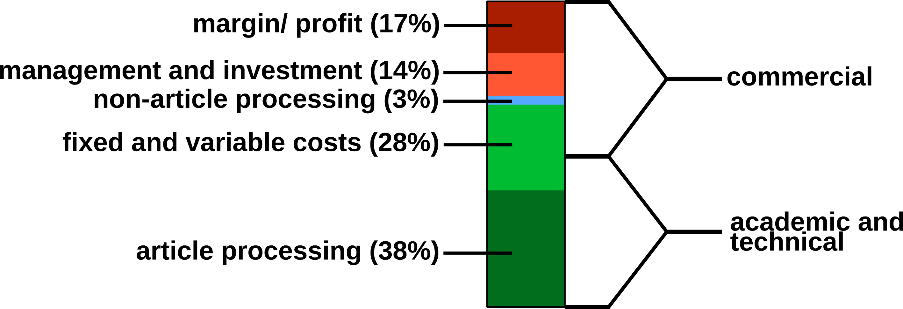
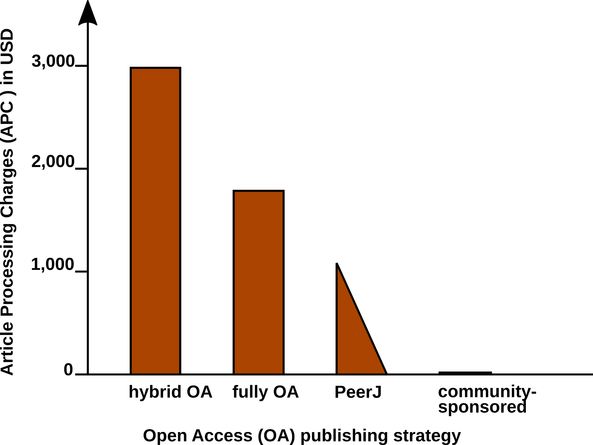
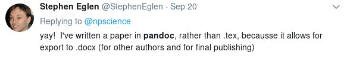
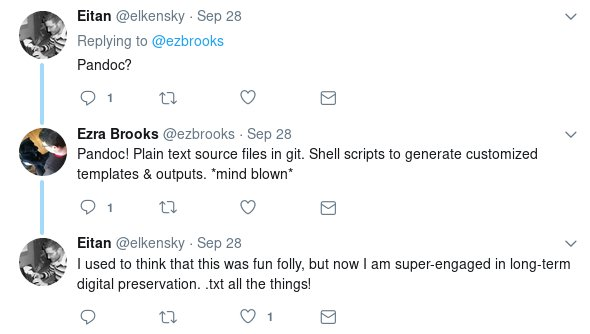
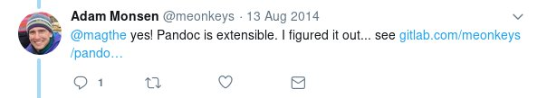
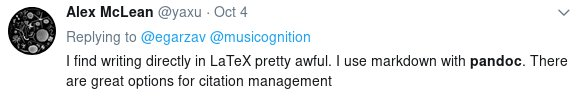
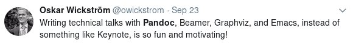
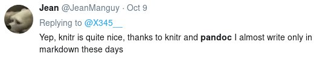
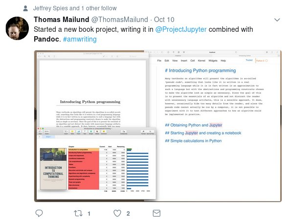

# Abstract

Markdown ist eine moderne Auszeichnungssprache und ist sowohl einfach zu lesen
als auch einfach zu schreiben, ohne spezielle Schreibprogramme zu benötigen.
Damit hat sie zahlreiche Vorteile gegenüber anderen Alternativen wie Word und
LaTeX und wird auf zahlreichen großen Webseiten eingesetzt.

John MacFarlane, Professor für Philosphie an der UC Berkeley, hat mit *pandoc*
ein Programm geschaffen, mit dessen Hilfe sich Markdown hervorragend für den
Wissenschafts- und Universitätsbetrieb einsetzen lässt. Kombiniert mit pandoc
lassen sich aus Markdown-Dokumenten ansehnlich gesetzte Abschlussarbeiten,
Papers, Präsentationen sowie Webseiten erzeugen.

Der Vortrag wird eine kurze Einführung in Markdown und dessen Benutzung mit
pandoc geben. Darüber hinaus wird auf die Bedeutung von Auszeichnungssprachen
für die Ziele der Offenen Wissenschaft eingegangen sowie die dafür relevanten
Erweiterungsmöglichkeiten von pandoc demonstriert.


# Kurze Intro

## Über mich

- Pro Freie Software und Freies Wissen
- Pandoc-Contributor
- Verfasser einer Masterarbeit mit LaTeX
- Software-Entwickler bei FTI

# Offene Wissenschaft

## Wo ist das Problem?

- Wissenschaft ist schnelllebiger geworden;
- Journals sind überteuert;
- Publizieren ist einfacher;
- Gedruckte Zeitschriften treten in den Hintergrund;
- Elektronische Methoden stehen im Vordergrund.

{width="80%"}

## Open Access Publishing

{width=80%}

## Peer Publishing

- Publikationsprozess auf's wesentlichste reduziert
- Review obliegt ohnehin Freiwilligen
- Kostenreduktion für Autoren, Lesende


## Beispiel: Wikipedia

- Umfangreiche Enzyklopädie
- Betrieben von Freiwilligen
- Moderate (keine?) finanziellen Interessen
- MediaWiki sorgt für einfaches Editieren


# Pandoc

## Universeller Dokumenten-Konverter

Geschaffen 2006 von John MacFarlane

Input-Formate
:   Markdown (6 variants), DocBook, Word docx, EPUB, Haddock, HTML, JSON, LaTeX,
    MediaWiki, native Pandoc, ODT, OPML, Emacs org-mode, Emacs Muse,
    reStructuredText, txt2tags, Textile, TWiki, and VimWiki.

Output-Formate
:   Beinahe alle Eingabeformate, plus AsciiDoc, LaTeX `beamer`, ConTeXt, DokuWiki,
    DZSlides, FB2, ICML, Groff man pages, PDF (via LaTeX), plain text, reveal.js,
    rtf, s5, Slideous, Slidy, TEI simple, TexInfo, and ZimWiki.

## Features

- Formatversteher
  
  {width=40%}
  
- Templating-Engine

  {width=40%}

- Erweiterungsmöglichkeiten

  {width=40%}

## Workflow

``` {#pandoc-workflow .dot .process}
digraph workflow {
  resources [shape=record, style=solid,
             label="{resources|{<f0>images |<f1>bibliography}}"];
  styles [shape=record, style=solid,
          label="{styles|{<f0>CSL |<f1>template}}"];
  { rank=same; resources styles }
  Markdown -> pandoc;
  resources -> pandoc; styles -> pandoc;
  pandoc -> pandoc [label=filters];
  pandoc -> docx; pandoc -> ePUB;
  pandoc -> PDF;  pandoc -> LaTeX;
  pandoc -> HTML; pandoc -> revealjs;
  pandoc -> ODF;
  Markdown -> resources [style=dotted, label="references"];
}
```

# Markdown
## Was ist falsch mit LaTeX?

- Einstiegshürden
- Lesbarkeit der Quelldateien
- Semantische Auszeichnungen
- Barrierefreiheit
- Print-Focus

## Dann also Word?

. . .

`\center{\huge{`{=latex}
AAAAAAAAAH, nein!
`}}`{=latex}

::: notes
Ähnliche Probleme, plus Interoperabilität, Kompatibilität, etc.
:::


## Was ist Markdown?
- Lesbares und leicht schreibbares Markup
- Eines (wenn nicht sogar *das*) Standardformat im Netz
- Basierend auf E-Mail Konventionen
- Entworfen von John Gruber und Aaron Schwarz

{width=50%}

## Beispiele
[Link zur CommonMark Online-Demo](http://spec.commonmark.org/dingus/).


# Pandoc erweitern

## Workflow

::: {.dot .process copy=pandoc-workflow}
replace with pandoc workflow
:::

## Input

::: {.dot copy=pandoc-workflow}
replace with pandoc workflow
:::

## DOT Filter

```{.include .dot}
filters/graphviz.lua
```

## Testimonial

{width=50%}

## Kombinierbar mit Vorlagen

- Pandoc hat eine Template Sprache.
- Bestehende Vorlagen sind einfach anzupassen.

`\vspace{2em}\center{\huge{`{=latex}
Demo: LaTeX thesis
`}}`{=latex}


## Mehr Vorteile

Pandoc ist nutzbar mit anderen Programmen:

- RStudio / knitr

  {width=50%}

- Jupyter

  {width=50%}


# Outro

## Danke

- Robert Winkler, CINVESTAV México
- John MacFarlane, UC Berkeley
- Allen pandoc Entwickler
- Nook Orga!

## Resourcen

### GitHub

<https://github.com/tarleb/talks>

### Paper

[Krewinkel A, Winkler R. (2017) Formatting Open Science: agilely creating
multiple document formats for academic manuscripts with Pandoc Scholar. *PeerJ
Computer Science* 3:e112
https://doi.org/10.7717/peerj-cs.112](https://doi.org/10.7717/peerj-cs.112)

## Zusammenfassung und Links
### Zusammenfassung
- Offene Wissenschaft braucht bessere Publikationsprozesse.
- Pandoc kann zahlreiche Formate lesen und schreiben.
- Bestehende Templates können wieder verwendet werden.
- Scripten und erweitern macht Pandoc sehr mächtig.

### Links
- Mastering Markdown: <https://guides.github.com/features/mastering-markdown/>

- Pandoc: <http://pandoc.org>

- CommonMark: <http://commonmark.org>

{width=50%}
