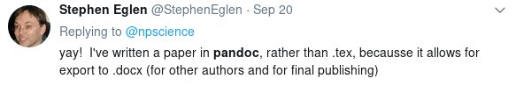
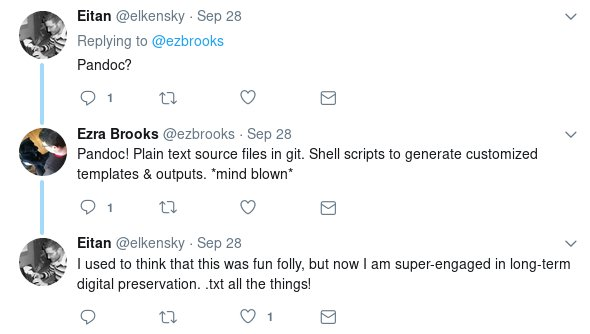
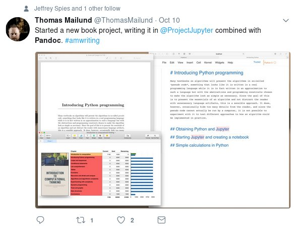

# Pandoc

## What is it?

- Created 2006 by John MacFarlane;
- designed for paper writing;
- allows flexible document conversion.

## Input formats

Markdown (6 variants), DocBook, Word docx, EPUB, Haddock, HTML,
JSON, LaTeX, MediaWiki, native Pandoc, ODT, OPML, Emacs org-mode,
Emacs Muse, reStructuredText, txt2tags, Textile, TWiki, and
VimWiki.

## Output formats

Almost all input formats, plus AsciiDoc, LaTeX `beamer`, ConTeXt,
DokuWiki, DZSlides, FB2, ICML, Groff man pages, PDF (via LaTeX),
plain text, PowerPoint pptx, reveal.js, rtf, s5, Slideous, Slidy,
TEI simple, TexInfo, and ZimWiki.

## Why is it useful?

- Broad choice of input formats,
- mathematical formulæ conversion,
- citation support (Bibtex, Endnote, Zotero…),
- creation of slides and handouts from the same document, and
- flexibility combined with simplicity.

## Document converter

{width=80%}

- - - - - - -

{width=80%}

- - - - - - -

{width=80%}

## Workflow

``` {#pandoc-workflow .dot .process}
digraph workflow {
  resources [shape=record, style=solid,
             label="{resources|{<f0>images |<f1>bibliography}}"];
  styles [shape=record, style=solid,
          label="{styles|{<f0>CSL |<f1>template}}"];
  { rank=same; resources styles }
  Markdown -> pandoc;
  resources -> pandoc; styles -> pandoc;
  pandoc -> pandoc [label=filters];
  pandoc -> docx; pandoc -> ePUB;
  pandoc -> PDF;  pandoc -> LaTeX;
  pandoc -> HTML; pandoc -> revealjs;
  pandoc -> ODF;
  Markdown -> resources [style=dotted, label="references"];
}
```

## Internal document representation

``` haskell
data Inline
    = Str String
    | Space | SoftBreak | LineBreak
    | Emph [Inline]
    | Strong [Inline]
    | Cite [Citation]  [Inline]
    | Code Attr String
    | Math MathType String
    | RawInline Format String
    | Span Attr [Inline]
    …
```

## Math demo

$E = mc^2$

$\int_{-3}^2 x^2 \mathrm{dx}$

$$
\chi (\lambda) = \left| \begin{array} {ccc}
\lambda - \omega &           -b &           -c \\
             -d  &  \lambda - e &           -f \\
             -g  &  -h          &  \lambda - i
\end{array} \right|
$$

## Testimonials

{width=50%}

- - - - - - - -

{width=50%}

- - - - - - - -

{width=50%}

## Possible use-cases

Math
:   Formula converter can be used to provide docx output.

Documentation
:   Documentation and (technical) presentations are pleasant to
    write.

Presentation
:   Allow multiple formats as input; convert (almost) any
    document to a presentation.

# Outro

## Summary and Links
- Pandoc can read and write multiple formats.
- It uses a unified, simple document representation.
- Scripting makes pandoc even more powerful.
- You could be using this.

- Pandoc: <http://pandoc.org>
- Filters: <http://pandoc.org/filter.html>

{width=50%}
